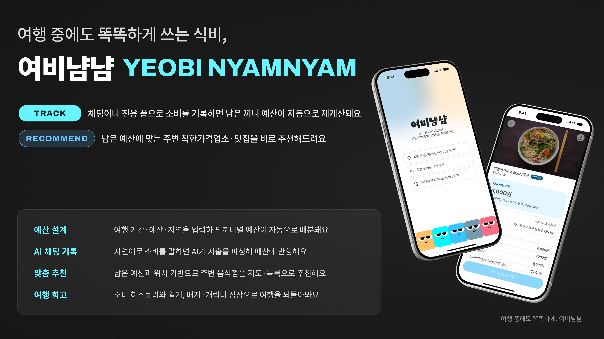
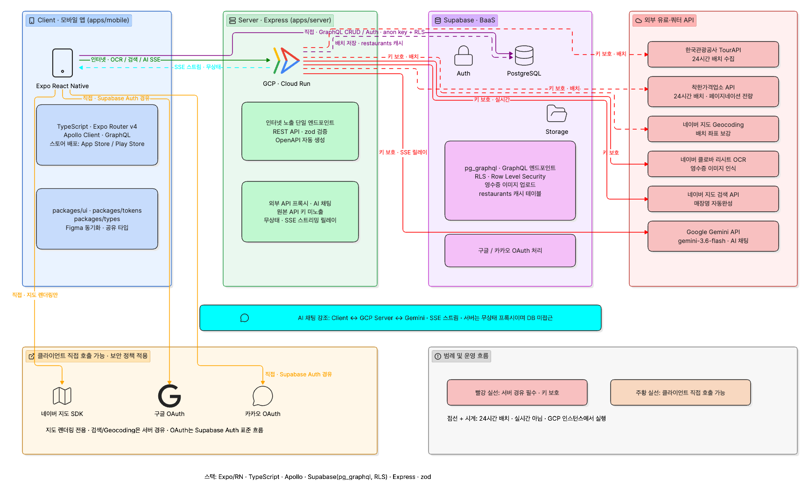

# 🍚 여비냠냠 (yeobi-nyamnyam)

> 여행 중 실시간으로 변하는 소비를 대화형/전용폼으로 기록하면, 남은 식비 예산에
> 맞춰 주변 음식점을 자동으로 재추천해주는 여행 식비 관리 앱

## 📌 서비스 소개

**여비냠냠**은 한국관광공사 TourAPI와 행정안전부 착한가격업소 API를 기반으로,
여행 중 소비 변동(끼니 지출, 기타 소비, 영수증 OCR 등)을 입력하면 남은 여행
기간·예산을 계산해 지금 갈 만한 주변 음식점을 다시 추천해주는 서비스입니다.

- 여행 생성 시 기간·예산·지역을 입력하면 끼니별로 예산이 자동 배분됩니다.
- 채팅(자연어) 또는 전용 폼으로 소비를 기록하면 이후 끼니들의 예산이 캐스케이드
  방식으로 자동 재계산됩니다.
- 남은 예산 대비 방문 가능한 음식점(착한가격업소 + TourAPI 맛집)을 지도/목록으로
  추천합니다.
- 여행이 끝나면 소비 히스토리, 일기, 배지·캐릭터 성장 등 게이미피케이션 요소로
  여행을 회고할 수 있습니다.

## 🔗 배포 링크

> 아직 배포 전입니다. (추후 업데이트 예정)

| 구분 | 링크 |
| --- | --- |
| 서비스 | _추후 업데이트_ |
| API 문서(Swagger) | _추후 업데이트_ |

## ✨ 주요 기능

| 대분류 | 설명 |
| --- | --- |
| 회원 인증 (F0) | 구글/카카오 소셜 로그인, 닉네임 설정, 약관 동의, 회원 탈퇴 |
| 여행 생성 (F1) | 여행지·기간·예산 입력, 끼니별 가중치 기본값 설정 |
| 예산 산정 (F2) | 전체 예산에서 고정비/유동비를 제외한 식비를 일별·끼니별로 자동 배분, 남은 끼니 기준 재분배 |
| 채팅 (C) | 대화형(자연어) 소비 입력 — AI가 지출 내역을 파싱해 예산에 반영 |
| 음식점 추천 (F3) | 남은 예산·위치 기반으로 착한가격업소·TourAPI 맛집을 지도/목록으로 추천 |
| 예산 수정 (F4) | 여행 중 예산 일괄 수정 시 남은 끼니 재분배 |
| 기록 (F6) | 끼니/기타 소비 기록, 영수증 OCR 자동 인식, 방문 매장 검색·자동완성 |
| 일기 (D) | 하루 여행을 되돌아보는 일기 작성 |
| 여행 완료 (F7) | 여행 종료 처리, 소비 히스토리 요약 |
| 게이미피케이션 - 배지 (G) | 소비 패턴·재분배 활용 등에 따른 배지 획득 |
| 캐릭터 성장 (L) | 활동에 따라 포인트를 얻어 캐릭터 성장 |
| 마이페이지 (M) | 여행 대시보드, 방문 매장 지도 |

> 기능 ID 상세 및 화면-폴더 매핑은 [`CLAUDE.md`](./CLAUDE.md) 참고

## 🛠 기술 스택

### Frontend (`apps/mobile`)

| 영역 | 스택 |
| --- | --- |
| 프레임워크 | Expo (React Native 0.85) + TypeScript |
| 라우팅 | Expo Router v4 (파일 기반 라우팅) |
| GraphQL 클라이언트 | Apollo Client + `graphql-codegen` |
| 스타일링 | React Native `StyleSheet` + `@repo/tokens`(디자인 토큰, Figma/Tokens Studio 자동 동기화) |
| 공통 컴포넌트 | `@repo/ui` (Storybook 기반) |
| 지도 | `@mj-studio/react-native-naver-map` (네이버 지도 SDK) |
| 소셜 로그인 | `@react-native-google-signin`, `@react-native-kakao` |
| 실시간 통신 | `react-native-sse` (AI 채팅 스트리밍) |
| 모니터링 | Sentry (`@sentry/react-native`) |
| 테스트 | Jest + `@testing-library/react-native` |

### Backend (`apps/server`)

| 영역 | 스택 |
| --- | --- |
| 프레임워크 | Express + TypeScript |
| 역할 | 외부 API 프록시(TourAPI, 착한가격업소, 네이버 지도 검색/Geocoding, 클로바 OCR) + AI 채팅 처리 |
| AI 채팅 LLM | Google Gemini (`@google/generative-ai`) — 무상태 프록시 + SSE 스트리밍 릴레이 |
| 스키마 검증 | Zod, API 문서화 `@asteasolutions/zod-to-openapi` + Swagger UI |
| 모니터링 | Sentry (`@sentry/node`) |
| 테스트 | Vitest |

### DB / Infra

| 영역 | 스택 |
| --- | --- |
| DB / Auth | Supabase (PostgreSQL, `pg_graphql`, Row Level Security) |
| 모노레포 | Turborepo + pnpm workspaces |
| 공유 패키지 | `@repo/types`(공유 타입), `@repo/tokens`(디자인 토큰), `@repo/ui`(공통 컴포넌트) |
| CI/CD | GitHub Actions (`ci.yml`, `tokens-sync.yml`, `restaurants-sync.yml`, `supabase-keepalive.yml`) |
| 코드 품질 | ESLint, Prettier, TypeScript strict (`any` 사용 금지) |

### 외부 API

- 구글 / 카카오 OAuth (소셜 로그인)
- 한국관광공사 TourAPI, 행정안전부 착한가격업소 API (서버 배치 수집 후 `restaurants` 캐싱)
- 네이버 지도 API (지도 렌더링은 클라이언트, 검색/Geocoding은 서버 경유)
- 네이버 클로바 리시트 OCR (서버 경유)
- Google Gemini (AI 채팅, 서버 경유)

## 🏗 서비스 아키텍처

## 👥 작업 분담

기능 대분류 기준 담당자 배정입니다. 자세한 내용과 재배정 히스토리는
[`docs/team-assignment.md`](./docs/team-assignment.md) 참고.

| 담당자 | 담당 영역 |
| --- | --- |
| 초연 | 회원 인증(F0), 여행 생성(F1), 예산 산정(F2), 채팅(C), 예산 수정(F4) |
| 희정 | 음식점 추천(F3), 마이페이지 - 방문 매장 지도(M2) |
| 수진 | 기록(F6), 일기(D), 여행 완료(F7), 게이미피케이션-배지(G), 캐릭터 성장(L), 마이페이지 - 대시보드(M0~M1) |

> **재배정(2026-09-02)**: 마이페이지 M2(방문 매장 지도)는 수진 → 희정으로,
> 게이미피케이션-배지(G) UI는 희정 → 수진으로 이관되었습니다. 배지 판정 서버
> 로직이 원래도 수진 담당이라, UI까지 같이 맡으면 서버·클라이언트 담당자가
> 일치합니다.

`apps/server`는 별도 담당자 없이 각 기능 담당자가 자기 도메인의 서버
라우터/프록시까지 함께 개발합니다 (Express 초기 스캐폴딩만 세션 초반에 팀
전체가 공동 작업).

## 🧑‍💻 팀 프로필

| | GitHub | 담당 |
| --- | --- | --- |
|  | [@choyeon2e](https://github.com/choyeon2e) | 초연 — 인증 · 여행 생성 · 예산 · 채팅 |
|  | [@DandelionQZ](https://github.com/DandelionQZ) | 희정 — 음식점 추천 · 마이페이지(지도) |
|  | [@lemoncurdyogurt](https://github.com/lemoncurdyogurt) | 수진 — 기록 · 일기 · 여행 완료 · 배지 · 캐릭터 · 마이페이지 |

## 📁 참고 문서

- [`CLAUDE.md`](./CLAUDE.md) — 프로젝트 개요, 스택, 컨벤션
- [`docs/schema-design.md`](./docs/schema-design.md) — DB 스키마 설계 근거
- [`docs/erd.mermaid`](./docs/erd.mermaid) — ERD
- [`docs/server-api-spec.md`](./docs/server-api-spec.md) — 서버 REST API 명세
- [`docs/business-logic-notes.md`](./docs/business-logic-notes.md) — 캐스케이드/재분배/배지판정 핵심 로직
- [`docs/api-server-boundaries.md`](./docs/api-server-boundaries.md) — 외부 API 서버/클라이언트 경계
- [`docs/team-assignment.md`](./docs/team-assignment.md) — 담당자 배정표
- [`docs/design-tokens-pipeline.md`](./docs/design-tokens-pipeline.md) — Figma → 디자인 토큰 자동 동기화 파이프라인